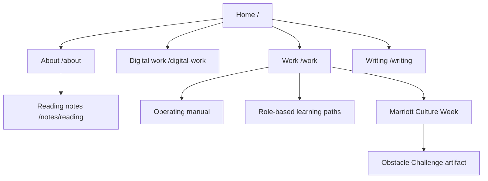

# Phase 2 - Information architecture

## Architecture decision

The portfolio will use an English-first, multi-route static architecture. The homepage will make the 90-second case. Depth routes will carry the proof.

Three professional L&D case studies remain the primary selected work. The independent web projects sit in a separate `Selected digital work` layer. This prevents personal publishing from competing with workplace evidence while preserving it as a major differentiator.

Territory 1 is now approved:

> I turn operating needs into learning systems people can use and leaders can trust.

## Sitemap

| Route | Page role | Publication status |
|---|---|---|
| `/` | The 90-second enterprise L&D case. | Required at launch. |
| `/work` | Index of professional L&D systems and programmes. | Required at launch. |
| `/work/ld-operating-manual` | Full case study for the 150-page operating manual. | Required, with `[NEEDS INPUT]` markers if artifacts are not yet cleared. |
| `/work/role-based-learning-paths` | Full case study for learning-path and role-mapping work. | Required, with redacted decision logic. |
| `/work/marriott-culture-week` | Full case study for Culture Week and Obstacle Challenge. | Required; strongest currently available interactive artifact. |
| `/digital-work` | Curated index of all eight independent web projects. | Required at launch. |
| `/about` | Accurate chronology, professional range, education, reading practice and Tri Thuc Books. | Required at launch. |
| `/writing` | Curated professional writing. | Build the route, but expose it in navigation only when three strong articles are supplied. |
| `/notes/reading` | Searchable archive of 325 books and 81 films. | Preserve, but move off the homepage. |
| `/artifacts/obstacle-challenge/` | Standalone working artifact linked from the Culture Week case study. | Publish only after confidentiality and brand review. |
| `/cv/nguyen-trung-kien-ld-specialist.pdf` | Direct CV asset. | Withhold until placeholders and factual conflicts are corrected. |
| `/404` | Useful recovery page. | Required. |
| `/sitemap.xml` and `/robots.txt` | Search discovery and crawl controls. | Required. |

## Global navigation

| Item | Destination | Purpose |
|---|---|---|
| Personal mark and `Kris Nguyen` | `/` | Return home. |
| Work | `/work` | Inspect professional L&D evidence. |
| Digital work | `/digital-work` | Inspect independent product-building evidence. |
| About | `/about` | Verify chronology and background. |
| Writing | `/writing` | Read professional thinking. Hidden until content threshold is met. |
| Download CV | CV asset | Primary navigation CTA after the PDF is corrected. |

`Roadmap`, `Edge`, `Position` and `Learning` will not remain navigation labels. They describe the current page structure rather than recruiter questions.

## Home page `/`

| Section | Purpose | Reader state on arrival | Reader state on exit | Content model | The one question it answers |
|---|---|---|---|---|---|
| Navigation | Give immediate access to evidence and application assets. | Scanning for relevance and legitimacy. | Knows where to verify work, background and CV. | Mark, four route links, CV CTA, mobile menu, skip link. | `Can I get to the proof quickly?` |
| Hero | Establish the approved position without foregrounding seniority. | Does not yet know why Kris is different. | Understands the systems-builder claim and sees two immediate proof paths. | Name, one-line positioning statement, two-sentence subhead, `View case studies`, `Download CV`. No hero image. | `Why should I keep reading?` |
| Credibility strip | Make the scale of the work scannable without calling outputs outcomes. | Interested but still sceptical. | Sees concrete scale and knows it is evidence, not decoration. | Three or four metric objects: value, precise label, source status. Initial candidates: `150-page manual`, `8 shipped web products`, `[NEEDS INPUT: property scope]`, `[NEEDS INPUT: adoption metric]`. | `Is there enough real work behind the claim?` |
| Selected work | Put the three strongest workplace cases first. | Wants proof from actual L&D work. | Can choose a full case study based on the capability being evaluated. | Three linked case cards: year/category, title, one-line effect, contribution, tags, artifact thumbnail. | `What has Kris built inside a real operation?` |
| Approach | Show a repeatable operating method rather than generic personality pillars. | Has seen examples but not the method connecting them. | Understands how Kris approaches a learning problem. | Four steps: diagnose the work, design the system, equip the operator, measure adoption. One restrained diagram. | `Is there a method I could trust on another problem?` |
| Selected digital work | Make independent product-building capability legible without displacing L&D cases. | Understands the workplace work and is evaluating differentiation. | Sees that Kris can independently research, structure and ship. | Three external project cards: English Studio, Krishnamurti, HCMC Labour Market. Each includes capability proven and personal contribution. | `Can he turn complex ideas into usable digital products?` |
| About preview | Humanise the evidence and show the current context. | Knows the work but not the person behind it. | Understands the combination of hospitality, education, psychology and independent building. | Short bio, one approved portrait, `currently / previously / studying`, link to About. | `What background produced this way of working?` |
| Writing preview | Show professional judgement in public. | Wants to know whether Kris can think beyond assigned tasks. | Has three pieces through which to evaluate reasoning and communication. | Three article cards with title, date, channel, summary and external/internal link. `[NEEDS INPUT: article URLs]` | `Can he articulate a useful point of view?` |
| Contact | Convert interest into a next action. | Has enough confidence to consider contact. | Can email, call, open LinkedIn or download the CV without friction. | One sentence, email, phone, LinkedIn and CV. No form. | `How do I continue the conversation?` |
| Footer | Close with the positioning and utility links. | Reaches the end of the page. | Retains the central claim and has one last path to contact. | Name, short position line, email, LinkedIn, CV, year. | `What should I remember?` |

## Work index `/work`

| Section | Purpose | Reader state on arrival | Reader state on exit | Content model | The one question it answers |
|---|---|---|---|---|---|
| Work header | Define what qualifies as evidence. | Has clicked specifically to inspect professional work. | Knows the cases are about systems, decisions and effects, not a project gallery. | H1, short framing statement, evidence standard note. | `What kind of work is shown here?` |
| Featured case studies | Route readers to the three complete cases. | Comparing capabilities. | Selects the case most relevant to the open role. | Three large case cards with capability, context, artifact and evidence status. | `Which case best proves the capability I need?` |
| Supporting systems and programmes | Preserve credible work that does not yet merit a depth page. | Wants breadth after reviewing the core cases. | Sees range without confusing every task with a case study. | Compact rows for Food Safety, OSH classification, orientation script, trainee tracker, delegation matrix and CDT credential. | `What else has he handled?` |
| Evidence note | Explain redaction and missing metrics honestly. | May notice placeholders or redacted materials. | Understands why some evidence is limited and what is verified. | Short disclosure statement and legend for verified, candidate-reported and needs-input evidence. | `Can I trust the way evidence is being presented?` |

## Case study architecture `/work/[slug]`

All three case studies share the same structure so recruiters can compare them quickly.

| Section | Purpose | Reader state on arrival | Reader state on exit | Content model | The one question it answers |
|---|---|---|---|---|---|
| Case hero | Identify the operating context and contribution. | Knows the title only. | Understands what was at stake, Kris's role and the evidence available. | Category, title, one-line result, role, timeframe, context, tags. | `What was this work and what did Kris own?` |
| Context | Explain the operation without unnecessary company detail. | Lacks the background needed to judge the work. | Understands audience, operating conditions and constraints. | Short prose, scope facts, confidentiality note. | `What environment shaped the problem?` |
| Challenge | Define the problem before the solution. | May assume this was simply a content-production task. | Understands the operational or behavioural gap. | Problem statement, symptoms, constraints, unknowns. | `What needed to change?` |
| What I designed | Make the system inspectable. | Wants to see the candidate's design contribution. | Can identify structure, components and design decisions. | Component list, decision rationale, artifact gallery, diagram where useful. | `What exactly did Kris create?` |
| How I ran it | Show execution and stakeholder work. | Knows the design but not whether it worked in practice. | Understands coordination, communication, facilitation and iteration. | Timeline, collaborators, delivery model, changes made during execution. | `Could he get the work adopted?` |
| Measured outcome | Separate output, adoption and effect. | Wants evidence of value. | Knows what is measured, what is only observed and what remains unknown. | Metric block with source/status, qualitative evidence and `[NEEDS INPUT]` gaps. | `What changed, and how do we know?` |
| What I would do differently | Demonstrate judgement and self-critique. | Is testing maturity, not perfection. | Sees a credible practitioner who can improve the next iteration. | Two or three specific limitations, consequences and next actions. | `Does he learn from the work honestly?` |
| Related work and CTA | Continue the evidence path. | Has completed one case. | Moves to another case or downloads the CV. | Two related cards and CV/contact CTA. | `What should I inspect next?` |

## The three professional case-study routes

| Route | Why it earns depth | Primary proof | Current gap |
|---|---|---|---|
| `/work/ld-operating-manual` | Best proof of the approved systems-builder position. It can show consolidation, governance, handover and repeatability. | Redacted pages, information structure, source-consolidation map and user guidance. | No sample, adoption evidence or operating effect supplied. |
| `/work/role-based-learning-paths` | Best proof of diagnosis, data judgement and handling ambiguity instead of guessing. | Redacted mapping logic, role-to-learning framework and example decision trail. | The exact scope, 19-person figure and resulting improvement require confirmation. |
| `/work/marriott-culture-week` | Best current proof of experience design and the ability to ship a working digital interaction. | Obstacle Challenge HTML, screenshots, programme structure and approved event photographs. | Learning objective, audience size, participant response and outcome data require input. |

### Why CDT is not a full case study yet

The supplied certificate proves that Kris completed CDT certification. It does not prove that he designed or facilitated the three-session trainer programme. Until ownership, contribution and programme evidence are confirmed, CDT belongs in `Supporting systems and programmes` and the About credentials list. Presenting it as a full case would weaken the evidence standard.

## Digital work `/digital-work`

| Section | Purpose | Reader state on arrival | Reader state on exit | Content model | The one question it answers |
|---|---|---|---|---|---|
| Digital-work header | Explain why independent web products matter to L&D. | May see websites as unrelated side projects. | Understands them as proof of research, learning interaction and information architecture. | H1, framing paragraph and three capability labels. | `Why are these websites in an L&D portfolio?` |
| Selected digital work | Feature the three projects with the strongest professional relevance. | Wants the strongest examples first. | Sees one learning product, one deep research system and one data product. | Three detailed cards with problem, audience, contribution, capability proven and live link. | `Which projects best prove transferable capability?` |
| Secondary index | Preserve breadth without giving every project equal weight. | Wants to explore further. | Can browse the remaining five projects without mistaking them for core L&D cases. | Five compact rows with type, description, capability and external link. | `What else has Kris independently shipped?` |
| Contribution standard | Protect credibility around AI and independent work. | May question authorship or production method. | Knows what Kris personally researched, wrote, designed and built. | Per-project contribution field and production note. `[NEEDS INPUT]` | `What did he actually do?` |

## Selection decision for the eight web projects

None of the eight digital projects will replace the three professional L&D cases in the primary `Selected work` section. Three earn homepage visibility in a separate `Selected digital work` section.

| Project | Placement | Decision |
|---|---|---|
| Kris's English Studio 2.0 | Homepage selected digital work, position 1; full card on `/digital-work`. | Most direct evidence of learning interaction, repeatable practice and learner usability. |
| Krishnamurti: A Human Life | Homepage selected digital work, position 2; lead research project on `/digital-work`. | Strongest proof of research depth, source discipline, editorial judgement and information architecture. It belongs as a digital research system, not as an L&D case study. |
| Ho Chi Minh City Labour Market 2026 | Homepage selected digital work, position 3; full card on `/digital-work`. | Demonstrates data storytelling, labour-market reasoning and business relevance. |
| Psychology in Vietnam | Secondary index, high priority. | Relevant to people and career development, but less direct proof of workplace L&D systems than the selected three. |
| Before Marriott | Secondary index. | Shows hospitality research and narrative design, but overlaps strongly with employer-brand subject matter and offers less differentiated L&D proof. |
| Bill Marriott: A Life of Service | Secondary index. | Useful leadership and hospitality work, but a second Marriott biography would over-concentrate the portfolio around one company. |
| The Man and His Country | Secondary index. | Demonstrates research and long-form publishing, but the subject has weak direct relevance to the target role. |
| Thân Ai Nấy Lo | Secondary index. | Shows Vietnamese long-form writing, but is primarily a personal book review and should not compete with enterprise evidence. |

## About `/about`

| Section | Purpose | Reader state on arrival | Reader state on exit | Content model | The one question it answers |
|---|---|---|---|---|---|
| About header | Give the person behind the systems position. | Wants context after seeing the work. | Understands Kris's current stage without being asked to evaluate a roadmap. | H1, short biography, approved portrait. | `Who is Kris beyond the case cards?` |
| Current practice | Describe present L&D scope accurately. | May overestimate or underestimate the role from the brand name. | Understands property-level scope and responsibilities. | Current role, property context, responsibilities, reporting line if approved. | `What does he actually do now?` |
| Experience timeline | Remove the false gap and show the coherent thread. | Is verifying career continuity. | Sees continuous progression from sales to education to L&D. | Accurate dates, role, organisation, one relevance sentence per role. | `How did this career develop?` |
| Education and development | Record qualifications without GPA theatre or unverified status. | Wants formal background. | Knows what is completed, in progress and planned. | Degree status, institution, year, selected credentials. | `What formal preparation supports the work?` |
| Independent practice | Frame Tri Thuc Books and reading as commercial and intellectual context. | May interpret side work as divided attention. | Understands it as a contained independent practice. | Tri Thuc Books description and Oreka link; compact reading note linking to `/notes/reading`. | `What does he practise outside his formal role, and why is it relevant?` |
| Contact and CV | Provide next steps. | Has verified the background. | Can continue immediately. | Email, phone, LinkedIn, CV. | `How do I contact or shortlist him?` |

## Writing `/writing`

| Section | Purpose | Reader state on arrival | Reader state on exit | Content model | The one question it answers |
|---|---|---|---|---|---|
| Writing header | Define the editorial scope. | Wants evidence of professional thinking. | Knows the topics and standard of selection. | H1 and one-sentence editorial position. | `What does Kris write about?` |
| Featured writing | Present the best three pieces. | Wants a fast sample. | Can evaluate reasoning, clarity and professional point of view. | Title, date, topic, excerpt, channel and link. | `Which pieces are most relevant to my evaluation?` |
| Writing index | Preserve additional articles without clutter. | Wants more depth. | Can browse by topic. | Filterable or grouped list: learning systems, hospitality and leadership, digital learning and research. | `What else can I read?` |
| Closing CTA | Return the reader to evidence or contact. | Has finished reading. | Moves to Work or CV. | Work link, CV link and email. | `What should I do next?` |

The route should not be visible in navigation until at least three strong URLs are supplied. An empty or placeholder-heavy Writing page would reduce credibility.

## Reading notes `/notes/reading`

| Section | Purpose | Reader state on arrival | Reader state on exit | Content model | The one question it answers |
|---|---|---|---|---|---|
| Reading introduction | Frame the archive as a long-term practice, not a status claim. | Arrives from About out of curiosity. | Understands why the archive exists and its limited role in the professional case. | Short introduction and current totals. | `Why does this archive belong here?` |
| Searchable archive | Preserve the existing interactive value. | Wants a title, author or category. | Can search and browse without interrupting the main portfolio. | Books and films, search, categories, favourites and reread counts. | `What has Kris read or watched?` |
| Return path | Bring the reader back to professional evidence. | Has explored the personal archive. | Returns to About or Work. | Two restrained links. | `Where do I return to the professional story?` |

## Utility pages

| Route | Content model | Question answered |
|---|---|---|
| `/404` | Plain-language message, Home, Work and Contact links. | `How do I recover from a broken or old link?` |
| CV asset | Corrected two-page PDF with no placeholders. | `Can I forward a formal application document?` |
| `sitemap.xml` | Home, Work, three case studies, Digital work, About, Writing when live and Notes. | `What content should search engines discover?` |
| `robots.txt` | Allow public portfolio routes and reference the sitemap. | `What may be indexed?` |

## Deletions, moves and replacements

| Current item | Decision | Justification |
|---|---|---|
| `Building toward L&D Manager` in hero | Delete. | It makes the recruiter evaluate missing seniority instead of current Specialist readiness. |
| Roadmap section | Delete from the public site. | It is a private development plan, not application evidence. |
| Position section with three generic pillars | Replace with the approved hero and four-step Approach. | The pillars are generic and unsupported. |
| Edge section | Dissolve into Approach, proof architecture and Digital work. | Its strongest ideas need evidence, not another standalone claim section. |
| GPA 2.76 and 3.27 on homepage | Delete from homepage. | Neither strengthens the enterprise shortlist enough to justify the attention. Degree status remains in About after verification. |
| Large book and film modal on homepage | Move to `/notes/reading`. | Preserve the differentiator without making the home page feel like a personal blog. |
| Flat list of seven websites | Replace with three selected digital cards and a secondary index of all eight. | Equal visual weight hides professional relevance and quality differences. |
| `Print profile` | Delete. | A corrected downloadable CV is a more useful application asset. |
| `EN / VI` hero claim | Remove until demonstrated. | Language ability should be shown through artifacts, not asserted in the first viewport. |
| Facebook in primary contact | Do not add at launch. | LinkedIn, email, phone and CV are sufficient for the enterprise audience. Facebook can support Writing later if professional posts justify it. |
| Portrait behind the hero | Move to About preview and `/about`. | Attachment A explicitly requires a typography-led hero without an image. |
| Full Vietnamese route | Defer. | English is the primary hiring language, and a duplicate route would double maintenance before equivalent Vietnamese content exists. Bilingual proof can begin with selected artifacts. |
| Public click-to-upload controls | Exclude. | Static GitHub Pages cannot persist uploads without authentication and storage. Repository-managed artifact slots are safer and sufficient. |

## URL preservation

- The root URL remains `https://krisnguyen2k1.github.io/`.
- All seven existing sub-project URLs remain unchanged.
- The Krishnamurti project remains at its verified Netlify URL and is linked from the portfolio.
- The Tri Thuc Books Oreka URL is linked from About.
- New portfolio routes must use static-export-compatible directory output.
- No new route may reuse or shadow an existing sub-project path.

## Assumption register

| ID | Assumption or unresolved fact | Phase 2 treatment |
|---|---|---|
| A01 | L&D Specialist in a large multinational or enterprise organisation is the target. | Defines home-page priority. |
| A02 | Territory 1 is approved. | Drives hero, Work and case-study architecture. |
| A03 | The public site remains English-first. | No `/vi` route at launch. |
| A04 | Publication rights for supplied workplace photographs are unresolved. | Artifact slots remain provisional. |
| A05 | The 150-page manual exists and consolidates six sources. | Full case route reserved; artifact and outcome still needed. |
| A06 | The figures `19`, `11`, `214`, `70+` and `five days` require confirmation. | Credibility strip and case metrics retain `[NEEDS INPUT]`. |
| A07 | Obstacle Challenge is Kris's work. | Standalone artifact route planned, subject to review. |
| A08 | CDT certificate proves certification completion, not programme ownership. | Supporting evidence only. |
| A09 | LinkedIn screenshot is the current chronology source. | About timeline uses those dates. |
| A10 | The exact six-week promotion claim remains unconfirmed. | Do not publish yet. |
| A11 | Education status is unresolved. | About content remains conditional. |
| A12 | Tri Thuc Books remains active and the supplied Oreka link is correct. | About route includes it without scale claims. |
| A13 | Email and phone are authorised for publication. | Contact model includes both. |
| A14 | Facebook is optional and not primary enterprise evidence. | Excluded at launch. |
| A15 | No verified outcome or adoption data has been supplied. | Case-study metric blocks distinguish output from outcome. |
| A16 | Kris has not owned a team, budget or enterprise LMS implementation. | No architecture element implies otherwise. |
| A17 | Current scope is property-level L&D within Marriott International. | Case context states scope precisely. |
| A18 | Exact contribution boundaries for eight web products are not documented. | `/digital-work` requires contribution fields. |
| A19 | The three professional cases are manual, role-based paths and Culture Week. | These receive depth routes. |
| A20 | CDT lacks sufficient ownership evidence for a depth case. | Supporting index only. |
| A21 | Writing URLs have not been supplied. | Build route model; hide from navigation until three pieces exist. |
| A22 | The current archive contains 325 books and 81 films. | Preserve on `/notes/reading`; totals should be checked before launch. |
| A23 | The uploaded CV is not publication-ready. | CV route withheld until corrected. |
| A24 | Public uploads are not required for portfolio success. | Use repository-managed artifact slots. |
| A25 | Existing sub-project deployments must remain reachable at their current paths. | New routes avoid those paths. |
| A26 | Krishnamurti is the strongest long-form research project. | Selected digital work, not professional L&D case study. |
| A27 | English Studio has the strongest direct learning-product relevance. | First selected digital card. |
| A28 | HCMC Labour Market has the strongest data and business relevance. | Third selected digital card. |
| A29 | A complete Vietnamese route would currently create duplicate maintenance without equivalent evidence. | Deferred backlog item. |
| A30 | Static-export depth routes can be deployed at the GitHub Pages user-site root without changing the seven project URLs. | Technical proof is deferred to Phase 5 and verified in Phase 6. |

Phase 2 ends here. Phase 3 begins only after approval.
